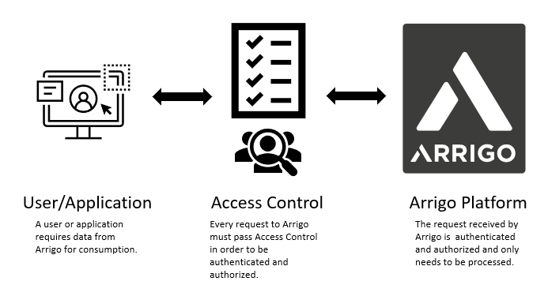
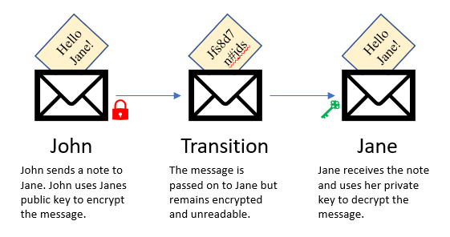

# Arrigo Security Statement

ver DRAFT - 24 Nov, 2021

author: Daniel Strand, Product Owner Arrigo

## Summary

Arrigo has been designed to utilize web security technologies in the best possible way and implementing its own application security to provide best possible security balanced with ease of use, configuration and maintenance.

The highlights from this paper are:

- Arrigo Local only requires an inbound port 443 when accessed from WAN
- Arrigo users and accounts can be secured with MFA and SSO (release Q1, 2022), this requires an outbound port 443
- Arrigo.se is hosted on Azure and has a comprehensive access, support and backup policy
- ArrigoConnect is an end-point secured and encrypted (TLS 1.2) connection, this requires an outbound port 443

## Dictionary

| Item          | Description                                                  |
| ------------- | ------------------------------------------------------------ |
| Arrigo Local  | On-premise installation of Arrigo                            |
| Arrigo.se     | Cloud instance of Arrigo                                 |
| Arrigo        | General Arrigo platform and its functionality in either or both Arrigo Local and Arrigo.se |
| ArrigoConnect | Data connection between Arrigo Local and Arrigo.se for retrieval of energy related data |

## Introduction

Arrigo challenges the boundaries of cyber and information security as its users and information is part of every level of an organization from low-level data such as a temperature in a room to high-level facility energy signature and big data lakes with information intended to be available to all users either directly or through aggregates.

Arrigo has multiple connection points and applications that communicate and transfers information. This information is distributed via wi-fi, Bluetooth, RS-485 networks, traditional networks, internet and sometimes through media such as USB keys. The information is then available on different devices such as desktops, phones, mobile devices or tablets. Each and every customer has to consider its own requirements and risks in order to apply end-to-end security.

Our top priority is the safety and security of your data. The industry and our customers demands a rigorous set of operating standards and we are committed to ensuring the highest standard s of cyber security throughout our codebase and across our customer base.

We continuously monitor our operations to identify and mitigate any new threats or vulnerabilities. 

## IT friendly

Arrigo Local only requires an inbound port 443 to communicate securely with SSL/TLS encryption over HTTP. IF EXO is used, then inbound port 26486 is also required for EXO device communications. All data from Arrigo can be safely routed through traditional firewalls and IT equipment as well as the use of antivirus software, intrusion detection systems and segmented network zones. Our services do not auto-update any OS components, all updates are controlled manually by our customers.

Arrigo.se is hosted on Microsoft Azure, a leading public cloud service provider. Azure have a range of physical and environmental security to data privacy and security controls. Azure complies to a number of standards such as ISO 27001/27017/27018 and AICPA SOC 2.

## Application security

Arrigo is specifically coded at the time of creation to be as secure as possible, to help ensure Arrigo is not vulnerable to attacks. All connections within Arrigo are designed to be secure through access control on the application Tree (i.e. folderID) not the actual writing or reading of a value. This enables Arrigo to be extremely efficient in controlling access regardless of devices used. A user may be assigned different access levels/attributes in different parts of the application tree and all subnodes inherit these attributes automatically. 

Since Arrigo's front-end only uses the API or its microservices, the access control is a secure and efficient security level that cannot be by-passed regardless of access method. Access is not possible without authentication and authorization.

Arrigo's security model is built around JWT (JSON web tokens) and on the methodology of OAuth2. Through a combination of *accessToken* and *refreshToken* Arrigo enables long-term connections with retained security, otherwise one of the risks with web-solutions.

## Data security

### Data at rest

*"...all data in storage but excludes any data that frequently traverses the network or that which resides in temporary memory. Data at rest includes but is not limited to archived data, data which is not accessed or changed frequently, files stored on hard drives, USB thumb drives, files stored on backup tape and disks, and also files stored off-site or on a [storage area network](https://en.wikipedia.org/wiki/Storage_area_network) (SAN)."* *-  What is data at rest? - A Word Definition From the Webopedia Computer Dictionary. Webopedia.com. 8 June 2007.*

Because of its nature, data at rest, is of increasing concern to businesses , governments and other institutions. The longer data is left unused in storage, the more likely it might be retrieved by unauthorized people outside the organization. 

Arrigo Local encrypts user passwords (AES). All encryption of data storage is up to the discretion of the customer to implement as well as any requirements for backup and redundancy. 

### Data in transit

*"Piece of data or information that is moving from one place to another, e.g. via an email, Slack or any type of public or private communication channel."* 

Data in transit can be separated into three categories: information that flows over the public or untrusted network such as the Internet, data that flows in the confines of a private network such as a corporate or enterprise local area network (LAN), and data that flows between Arrigo's microservices.

With an installed certificate, all data flows to and from Arrigo are encrypted using SSL/TLS over HTTP (HTTPS) on port 443 using Advanced Encryption Standard (AES) 256-bit encryption with secure 2048-bit X.509 certificates. Our secure and publicly available API using graphQL/REST is also using this security scheme as well as our websocket communications.

Communication between Arrigo's microservices within a single Arrigo Local is not required to be encrypted, but still retains authentication and authorization for access.

### Data in use

*"Data in use is an information technology term referring to active data which is stored in a non-persistent digital state typically in computer random-access memory (RAM), CPU caches, or CPU registers."*

Because of its nature, data in use is of increasing concern to businesses, government agencies and other institutions. Data in use, or memory, can contain sensitive data including digital certificates, encryption keys, intellectual property (software algorithms, design data), and personally identifiable information. Compromising data in use enables access to encrypted data at rest and data in motion. For example, someone with access to random access memory can parse that memory to locate the encryption key for data at rest. Once they have obtained that encryption key, they can decrypt encrypted data at rest. Threats to data in use can come in the form of cold boot attacks, malicious hardware devices, rootkits and bootkits.

Basic protection and common sense should be used such as authetication on all devices, mobile devices should have faceID or be locked with a code, workstations should be locked during breaks or when unattended.

## GDPR and data protection

In 2016, the European Parliament and Council agreed on the General Data Protection Regulation (GDPR). In the spring of 2018, the GDPR began requiring companies to:

- provide data breach notifications
- appoint a data-protection officer
- require user consent for data processing
- anonymize data for privacy

All companies operating within the EU must comply with these standards.

Please read "Software as a Service Agreement" for Arrigo.se for further details on your data protection.
